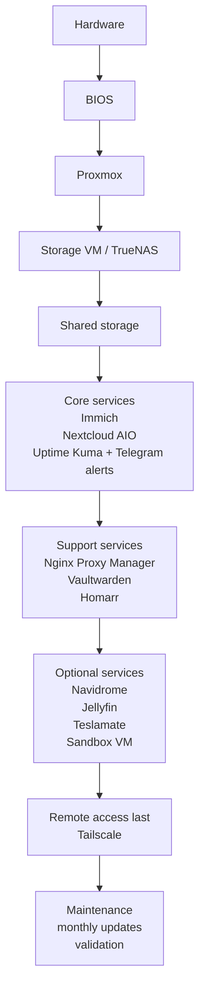

# Home Lab Server Build Guide

This repository is a rebuild manual for the current Proxmox-based home lab.
It is organized so a human can follow it in order, from the first boot on a physical screen to the final optional remote-access layer.

Version note: the documented Proxmox baseline was verified on Proxmox VE `9.1.6` with kernel `6.17.13-1-pve`. Treat that as the known-good baseline, not a hard pin. If you are on a newer compatible release, keep following the guide as long as the commands and UI labels still match.

If you are new to this, start with [`docs/00-overview.md`](docs/00-overview.md) and then follow the numbered steps below in order.

## What doc do I follow for what step?

| Step | Read this | Run it here |
| --- | --- | --- |
| 0. Overview | [`docs/00-overview.md`](docs/00-overview.md) | Read this first to understand the full architecture |
| 1. Physical build | [`docs/01-hardware-and-wiring.md`](docs/01-hardware-and-wiring.md) | In the server chassis with keyboard and screen |
| 2. BIOS and install | [`docs/02-bios-and-proxmox-install.md`](docs/02-bios-and-proxmox-install.md) | On the physical server console |
| 3. Virtualization tuning | [`docs/03-iommu-and-passthrough.md`](docs/03-iommu-and-passthrough.md) | On the Proxmox host through the local console or SSH from your Mac |
| 4. Storage VM | [`docs/04-truenas-vm-setup.md`](docs/04-truenas-vm-setup.md) | On the Proxmox host and in the TrueNAS web UI |
| 5. Shared storage | [`docs/05-storage-and-shares.md`](docs/05-storage-and-shares.md) | On the Proxmox host and in the TrueNAS shell/UI |
| 6. Nextcloud AIO setup | [`docs/06-nextcloud-aio-setup.md`](docs/06-nextcloud-aio-setup.md) | On the Proxmox host, then inside the Document VM |
| 7. Immich Photos CT | [`docs/07-immich-photos-ct.md`](docs/07-immich-photos-ct.md) | On the Proxmox host, then inside the Photos CT |
| 8. Uptime Kuma monitoring CT | [`docs/08-uptime-kuma-monitoring-ct.md`](docs/08-uptime-kuma-monitoring-ct.md) | On the Proxmox host, then inside the Monitoring CT |
| 9. Vaultwarden password CT | [`docs/09-vaultwarden-password-ct.md`](docs/09-vaultwarden-password-ct.md) | On the Proxmox host, then inside the Password CT |
| 10. Nginx Proxy Manager proxy CT | [`docs/10-nginx-proxy-manager-proxy-ct.md`](docs/10-nginx-proxy-manager-proxy-ct.md) | On the Proxmox host, then inside the Proxy CT |
| 11. Homarr dashboard CT | [`docs/11-homarr-dashboard-ct.md`](docs/11-homarr-dashboard-ct.md) | On the Proxmox host, then inside the Dashboard CT |
| 12. Navidrome music CT | [`docs/12-navidrome-music-ct.md`](docs/12-navidrome-music-ct.md) | On the Proxmox host, then inside the Music CT |
| 13. Jellyfin media CT | [`docs/13-jellyfin-media-ct.md`](docs/13-jellyfin-media-ct.md) | On the Proxmox host, then inside the Media CT |
| 14. Teslamate telemetry CT | [`docs/14-teslamate-telemetry-ct.md`](docs/14-teslamate-telemetry-ct.md) | On the Proxmox host, then inside the Telemetry CT |
| 15. Sandbox VM | [`docs/15-sandbox-vm.md`](docs/15-sandbox-vm.md) | On the Proxmox host and inside the Sandbox VM |
| 16. Backup and restore | [`docs/16-backup-restore.md`](docs/16-backup-restore.md) | On the Proxmox host and on the backup server |
| 17. Remote access last | [`docs/17-remote-access-tailscale.md`](docs/17-remote-access-tailscale.md) | Only after the local-network build is working |
| 18. Maintenance and updates | [`docs/18-maintenance-and-updates.md`](docs/18-maintenance-and-updates.md) | Monthly from your workstation, the Proxmox host, and service web UIs |

## Build Architecture

If the diagram below does not render in your viewer, read it as a straight vertical stack:

Hardware -> BIOS -> Proxmox -> Storage VM / TrueNAS -> Shared storage -> Core services -> Support services -> Optional services -> Remote access last



## Build tiers

### Tier 0 - foundation

These are required before any app service is worth deploying:

- Hardware
- BIOS settings
- Proxmox install
- Host networking
- Storage layout

### Tier 1 - core lab

These make the lab actually useful:

- Storage VM
- Shared storage mounts
- Immich
- Nextcloud AIO
- Uptime Kuma with Telegram system-down alerts
- Backups and restore checks

### Tier 2 - support layer

These improve daily use but are not the core:

- Nginx Proxy Manager
- Vaultwarden
- Homarr

### Tier 3 - optional layer

These can wait until the core is stable:

- Navidrome
- Jellyfin or Plex-style media service
- Teslamate
- Sandbox or side-project VM

## Current lab shape

### VM/CT roles

- Storage VM running TrueNAS SCALE
- Document and collaboration VM running Nextcloud AIO
- Optional sandbox VM for side projects
- Photos CT running Immich
- Music CT running Navidrome
- Media CT running Jellyfin
- Dashboard CT running Homarr
- Password manager CT running Vaultwarden
- Monitoring CT running Uptime Kuma
- Vehicle telemetry CT running Teslamate
- Reverse proxy CT running Nginx Proxy Manager

### Storage labels used in this guide

- `local-storage` for ISOs, templates, snippets, and small host artifacts
- `local-vm-storage` for the boot-side VM disk pool
- `vm-data` for most VM/CT disks and container root filesystems
- `backups` for the mounted external backup target

## How to use this repo

- Start with the overview, then follow the phase docs in order.
- Keep the first install steps on the physical server with keyboard and screen.
- Move to SSH from a separate computer only after Proxmox networking is up.
- Keep the core lab on the local network until the remote-access doc is complete.
- Use the VM/CT labels in this guide instead of the original ad hoc names.
- When a step includes a command block, copy and paste it into the machine named in the doc.
- When a step says “capture” or “verify,” run the exact command shown and keep the output for your own notes.

## Repository structure

```text
.
├── README.md
├── docs/
│   ├── 00-overview.md
│   ├── 01-hardware-and-wiring.md
│   ├── 02-bios-and-proxmox-install.md
│   ├── 03-iommu-and-passthrough.md
│   ├── 04-truenas-vm-setup.md
│   ├── 05-storage-and-shares.md
│   ├── 06-nextcloud-aio-setup.md
│   ├── 07-immich-photos-ct.md
│   ├── 08-uptime-kuma-monitoring-ct.md
│   ├── 09-vaultwarden-password-ct.md
│   ├── 10-nginx-proxy-manager-proxy-ct.md
│   ├── 11-homarr-dashboard-ct.md
│   ├── 12-navidrome-music-ct.md
│   ├── 13-jellyfin-media-ct.md
│   ├── 14-teslamate-telemetry-ct.md
│   ├── 15-sandbox-vm.md
│   ├── 16-backup-restore.md
│   ├── 17-remote-access-tailscale.md
│   └── 18-maintenance-and-updates.md
├── images/
├── scripts/
│   └── proxmox-monthly-maintenance.sh
└── templates/
```

## Notes for a clean rebuild

- Keep live credentials out of Git.
- Keep private network details in your local notes.
- Use this repo to reconstruct the layout, order, and command sequence.
- If a step requires a browser click or GUI action, the doc should say so explicitly.
- The documented Proxmox baseline was verified on `9.1.6` with kernel `6.17.13-1-pve`; newer compatible versions are fine if the commands and UI labels still match.
