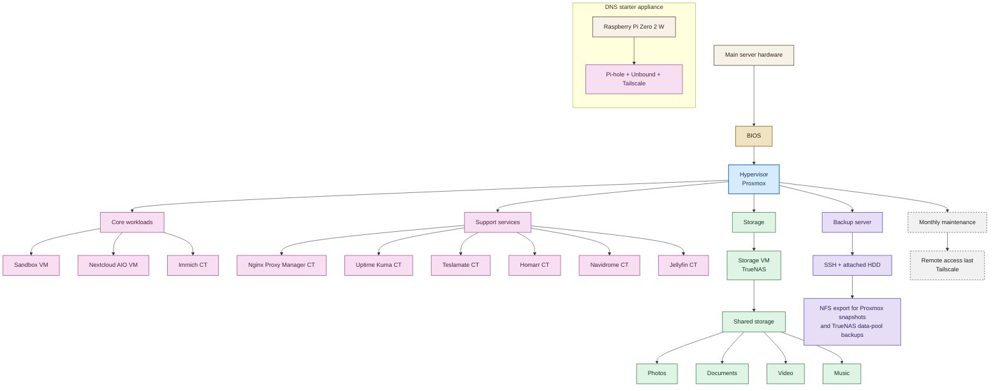

# 00 - Build Overview

## Goal

This document explains the full rebuild path at a glance.
Use it to understand the order of the build before diving into the phase docs.

## Build Architecture

If the diagram below does not render in your viewer, read it as separate hardware tracks:
the DNS starter is its own Raspberry Pi appliance, and the main lab branches into workloads, storage, backup, and maintenance from the Proxmox host.

## What matters most

### Required path

If you are rebuilding only the important parts, this is the shortest useful order:

1. DNS starter with Pi-hole and Unbound
2. Physical hardware and wiring
3. BIOS virtualization settings
4. Proxmox host install
5. Storage VM
6. Shared storage mounts
7. Nextcloud AIO
8. Immich Photos CT
9. Uptime Kuma monitoring CT
10. Vaultwarden password CT
11. Nginx Proxy Manager proxy CT
12. Homarr dashboard CT
13. Navidrome music CT
14. Jellyfin media CT
15. Teslamate telemetry CT
16. Sandbox VM
17. Backup and restore
18. Remote access last

### Optional path

The first seven steps are infrastructure. Everything from step 8 onward is the actual lab shape.

## How the lab is layered

- DNS starter gives you a useful first service before the server build.
- Hardware provides the physical base.
- BIOS enables virtualization and passthrough.
- Proxmox hosts the VM/CT layer.
- The storage VM manages disks, pools, and exports.
- The Proxmox host mounts shared storage from the storage layer.
- Essential VM/CT services provide day-to-day usefulness.
- Support services make the lab easier to use.
- Optional services can be added later without changing the core build.
- Remote access comes last, after the local-only build is working.

## Host summary

- Verified Proxmox VE baseline: `9.1.6`
- Verified kernel baseline: `6.17.13-1-pve`
- Newer compatible releases are fine if the commands and UI labels still match
- Host bridge: `vmbr0`
- Generic storage labels used in this guide:
  - `local-storage`
  - `local-vm-storage`
  - `vm-data`
  - `backups`

## VM/CT summary

### VMs

- Storage VM: TrueNAS SCALE
- Document and collaboration VM: Nextcloud AIO
- Optional sandbox VM

### CTs

- Photos CT: Immich
- Monitoring CT: Uptime Kuma
- Password manager CT: Vaultwarden
- Proxy CT: Nginx Proxy Manager
- Dashboard CT: Homarr
- Music CT: Navidrome
- Media CT: Jellyfin
- Vehicle telemetry CT: Teslamate

### Diagram legend

- `hardware`: physical server or appliance
- `bios`: firmware settings that enable the build
- `hypervisor`: Proxmox host layer
- `storage`: storage VM and shared data paths
- `vmct`: VM and CT workload nodes
- `backup`: separate backup server and NFS export
- `maintain`: remote access and monthly maintenance

## Build sequence

1. Read the overview.
2. Set up the DNS starter.
3. Build the hardware.
4. Configure BIOS.
5. Install Proxmox.
6. Build the storage VM.
7. Mount shared storage.
8. Set up Nextcloud AIO.
9. Deploy the Photos CT.
10. Deploy the Monitoring CT.
11. Deploy the Password CT.
12. Deploy the Proxy CT.
13. Deploy the Dashboard CT.
14. Deploy the Music CT.
15. Deploy the Media CT.
16. Deploy the Telemetry CT.
17. Deploy the Sandbox VM if you need one.
18. Set up backup and restore.
19. Add remote access only after the local build is stable.

## Where to run things

- Physical hardware and BIOS changes happen on the server with a keyboard and screen attached.
- Proxmox host checks happen on the server console first, then over SSH from another computer on the local network.
- TrueNAS setup happens in the VM console and the TrueNAS web UI.
- VM/CT service setup happens through the Proxmox UI and then inside each VM/CT shell.
- Remote access setup happens last from a computer on the same local network.
